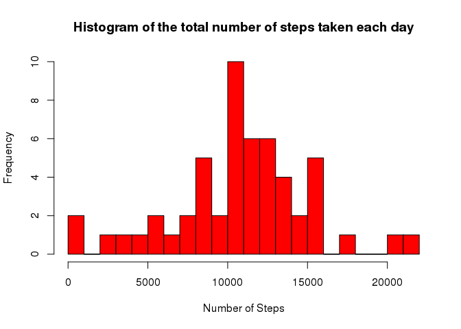
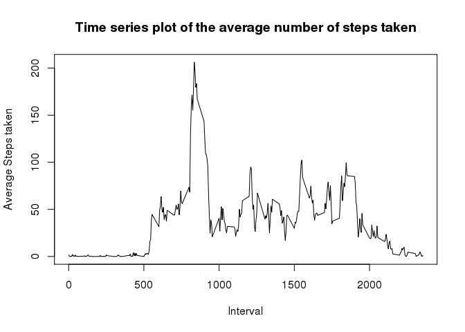
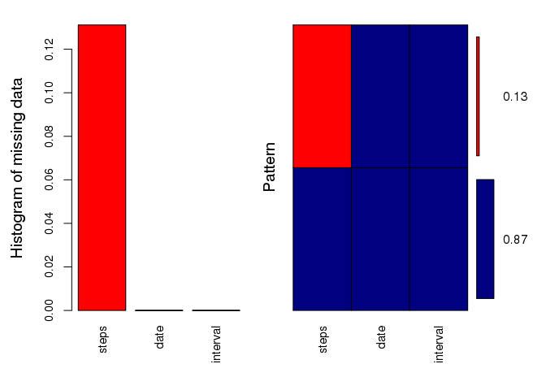
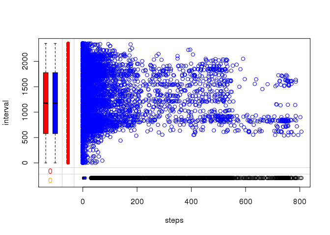
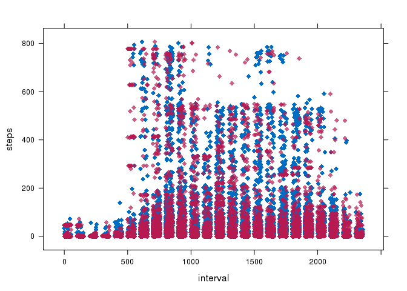
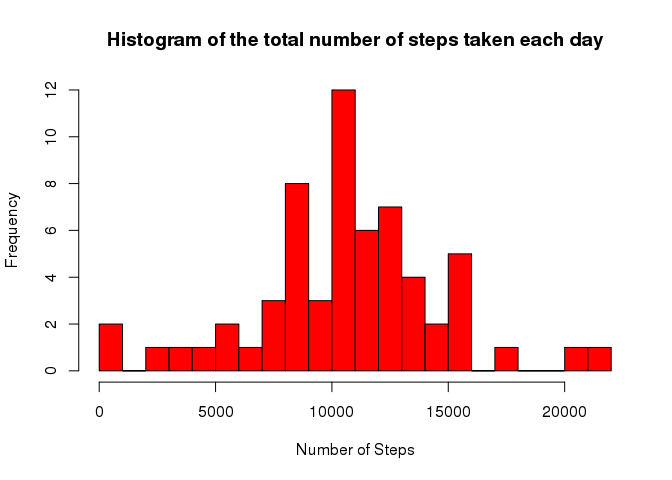
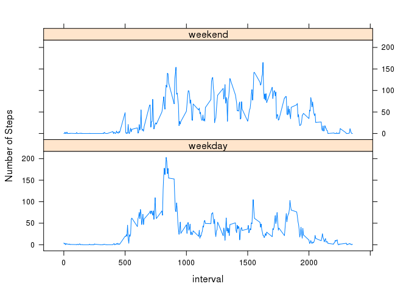

# Reproducible Research: Peer Assessment 1


## Loading and preprocessing the data

***
Effort here is to upload the csv file for further analysis.
Alongside, I am preparing 2 data frames which will contain the required data:

* activity_data1 will contain the csv as is.
* activity_data will contain only non NA data.


```r
    library(dplyr)
    library(mice)
    library(VIM)
    library(lattice)
    library(ggplot2)
    library(zoo)
```

```r
    setwd("/home/ruser/coursera_courses/reproducibleResearch/proj_assign_week_1/RepData_PeerAssessment1")
    activity_data1 <- read.csv("activity.csv", header = T, sep = ",")
    activity_data1$date <- as.Date(activity_data1$date, "%Y-%m-%d")
    activity_data <- activity_data1[complete.cases(activity_data1$steps), ]
```


***
## What is mean total number of steps taken per day?

* To answer this question, we will have to aggregate steps information by date.
* Assigning names to the columns in the data frame with name agg
* Plotting the histogram from the aggregated data to obtain a picture of the total number of steps taken per day.


```r
    agg <- aggregate(activity_data$steps, by = list(activity_data$date), FUN=sum)
    names(agg) <- c("date", "total_steps")
    hist(as.numeric(agg$total_steps), breaks = 20, col = "red", xlab = "Number of Steps", main= "Histogram of the total number of steps taken each day")
```

 


## What is the average daily activity pattern?

```r
    mean(agg$total_steps)
```

```
## [1] 10766.19
```

```r
    median(agg$total_steps)
```

```
## [1] 10765
```

```r
    agg1 <- aggregate(activity_data$steps, by = list(activity_data$interval), FUN=mean)    
    names(agg1) <- c("interval", "avg_steps")
    plot(y=agg1$avg_steps, x=agg1$interval, type='l'
         , xlab = "Interval", ylab = "Average Steps taken", main= "Time series plot of the average number of steps taken")
```

 

```r
    max(agg1$avg_steps)
```

```
## [1] 206.1698
```

```r
    agg1[which.max(agg1$avg_steps), ]
```

```
##     interval avg_steps
## 104      835  206.1698
```


## Imputing missing values

Meaning of the very word "IMPUTE": assign (a value) to something by inference from the value of the products or processes to which it contributes.

There are many ways one could impute missing values through R, one is as suggested in the Assignment itself.
I tried to find and read more on how to Impute in R and found this website which is very informative: http://www.r-bloggers.com/imputing-missing-data-with-r-mice-package/

***
So here is what I have done to Impute:

* Used a library named MICE
* Use the command md.pattern passing our data frame to get a picture of the extent of missing values


```r
    md.pattern(activity_data1)
```

```
##       date interval steps     
## 15264    1        1     1    0
##  2304    1        1     0    1
##          0        0  2304 2304
```

From the output of the above command we can notice that there are 2304 rows missing values for the steps column. The rest seem to be ok.

Here is a graphical way to understand the missing values:


```r
    aggr_plot <- aggr(activity_data1, col=c('navyblue','red'), numbers=TRUE, sortVars=TRUE
                      , labels=names(data), cex.axis=.9, gap=3, ylab=c("Histogram of missing data","Pattern")
                      )
```

 

```
## 
##  Variables sorted by number of missings: 
##  Variable     Count
##     steps 0.1311475
##      date 0.0000000
##  interval 0.0000000
```

Marginplot is another method, to graphically view the layout of the missing values, only this time it is through box plots, note the boxplots on the left (Y axis) and another in the bottom (X axis):


```r
    marginplot(activity_data1[,c("steps", "interval")], col=c("blue", "red", "orange"))
```

 

To Impute the missing values, we should use the command mice and pass the data frame as the parameter, I am capturing the imputed values into a variable named "imputedData", folloing the mice command I am trying to check the metadata of the variable imputedData, please take a note of the different details:

*(Oh yes, for the mice to be able to impute data it can operate only on integer values, so I had to convert the date values to numeric (we can return back later))*


```r
    activity_data1$date <- as.numeric(activity_data1$date)
    imputedData <- mice(activity_data1)
```


```r
    summary(imputedData)
```

```
## Multiply imputed data set
## Call:
## mice(data = activity_data1)
## Number of multiple imputations:  5
## Missing cells per column:
##    steps     date interval 
##     2304        0        0 
## Imputation methods:
##    steps     date interval 
##    "pmm"       ""       "" 
## VisitSequence:
## steps 
##     1 
## PredictorMatrix:
##          steps date interval
## steps        0    1        1
## date         0    0        0
## interval     0    0        0
## Random generator seed value:  NA
```

Now that we have imputed the missing values, we have to formulate a new data frame which will have the orignially non-missing values + the imputed data, command to do the same is "complete" I am capturing the output in a variable "completedData"


```r
    completedData <- complete(imputedData, 1)
```

A graph to understand the distribution of the imputed data, Megenta in color:
(There are other ways to view the same using densityplot and stripplot)


```r
    xyplot(imputedData, steps ~ interval, pch=18 ,cex=1)
```

 


***
Now that we have imputed the values, let us:

* Switch the class of date column back to Date.
* Aggregate steps by date
* Assign names to the newly formed variable agg2, to be able to identify the data witin.


```r
    completedData$date <- as.Date(completedData$date)
    agg2 <- aggregate(completedData$steps, by = list(completedData$date), FUN=sum)
    names(agg2) <- c("date", "total_steps")
```

Let us check the mean and median on the aggregated completedData:


```r
    mean(agg2$total_steps)
```

```
## [1] 10605.03
```

```r
    median(agg2$total_steps)
```

```
## [1] 10468
```


Finally we can hava a graph to view the data from the completed data (with no NAs):


```r
    hist(as.numeric(agg2$total_steps), breaks = 20, col = "red", xlab = "Number of Steps", main= "Histogram of the total number of steps taken each day")
```

 


## Are there differences in activity patterns between weekdays and weekends?
***
We have previously imputed and captured the complete data set in the data frame variable named "completedData", now I am adding 2 more columns to this data frame to be able to answer the question above.

* The first column being added will be named "weekdayorend" this will contain 1 for rows with weekdays and 0 for weekends.
* Second column would be "day" this will contain "weekday" for weekdays and "weekend" for weekends.
* aggregate to capture mean values of steps data by interval and day.
* Assign right names to identify the aggregated data frame named "agg_weekdayorend".
* Finally a time series plot to compare and differentiate data through weekdays and weekends.


```r
    completedData$weekdayorend <- ifelse(weekdays(completedData$date) != "Saturday"
                                            , ifelse(weekdays(completedData$date) != "Sunday"
                                                      , 1
                                                      , 0
                                                    )
                                            , 0
                                          )
    completedData$day <- ifelse(weekdays(completedData$date) != "Saturday"
                                         , ifelse(weekdays(completedData$date) != "Sunday"
                                                  , "weekday"
                                                  , "weekend"
                                         )
                                         , "weekend"
    )
    agg_weekdayorend <- aggregate(completedData$steps, by=list(completedData$interval, completedData$day), FUN = mean)
    names(agg_weekdayorend) <- c("interval", "day", "avg_steps")
    xyplot(data = agg_weekdayorend, avg_steps ~  interval | day, layout = c(1,2), type ="l", ylab="Number of Steps")
```

 


Looking at the data distribution through the above graph I would like to believe the activity is more distrubuted through the day for weekends whereas it is not so in the weekday's.

ps: I really loved doing it all through rmd to knit to html.
